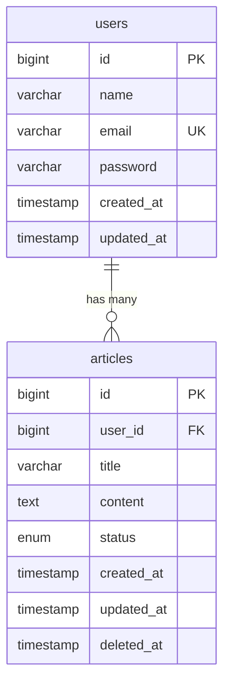

# データベース設計書

## 概要

ADR Blog Lite のデータベース設計書です。学習目的に最適化されたシンプルな構成となっています。

## 技術仕様

- **データベース**: SQLite 3.x
- **ORM**: Laravel Eloquent
- **マイグレーション**: Laravel Migration
- **文字エンコーディング**: UTF-8

## ER図



## テーブル設計

### users テーブル

**目的**: ブログ管理者の認証情報を管理

| カラム名 | データ型 | 制約 | 説明 |
|---------|---------|------|------|
| id | bigint | PK, AUTO_INCREMENT | ユーザーID |
| name | varchar(255) | NOT NULL | ユーザー名 |
| email | varchar(255) | UNIQUE, NOT NULL | メールアドレス |
| password | varchar(255) | NOT NULL | ハッシュ化パスワード |
| created_at | timestamp | NULL | 作成日時 |
| updated_at | timestamp | NULL | 更新日時 |

**インデックス**:
- PRIMARY KEY (id)
- UNIQUE INDEX (email)

**学習ポイント**:
- Laravel標準のusersテーブル構造
- Eloquentの認証機能との連携
- ハッシュ化パスワードの適切な管理

### articles テーブル

**目的**: ブログ記事の情報を管理

| カラム名 | データ型 | 制約 | 説明 |
|---------|---------|------|------|
| id | bigint | PK, AUTO_INCREMENT | 記事ID |
| user_id | bigint | FK, NOT NULL | 投稿者ID |
| title | varchar(255) | NOT NULL | 記事タイトル |
| content | text | NOT NULL | 記事本文（Markdown） |
| status | enum('draft', 'published') | DEFAULT 'draft' | 公開状態 |
| created_at | timestamp | NULL | 作成日時 |
| updated_at | timestamp | NULL | 更新日時 |
| deleted_at | timestamp | NULL | 削除日時（論理削除） |

**インデックス**:
- PRIMARY KEY (id)
- INDEX (user_id)
- INDEX (status)
- INDEX (created_at)
- INDEX (deleted_at) - 論理削除対応

**外部キー制約**:
- FOREIGN KEY (user_id) REFERENCES users(id) ON DELETE CASCADE

**学習ポイント**:
- Eloquentリレーションシップの実装
- ソフトデリート（論理削除）の実装
- 列挙型（enum）の活用
- 効率的なインデックス設計

## マイグレーションファイル例

### users テーブル

```php
<?php
// database/migrations/2024_01_01_000000_create_users_table.php

use Illuminate\Database\Migrations\Migration;
use Illuminate\Database\Schema\Blueprint;
use Illuminate\Support\Facades\Schema;

return new class extends Migration
{
    public function up(): void
    {
        Schema::create('users', function (Blueprint $table) {
            $table->id();
            $table->string('name');
            $table->string('email')->unique();
            $table->string('password');
            $table->timestamps();
        });
    }

    public function down(): void
    {
        Schema::dropIfExists('users');
    }
};
```

### articles テーブル

```php
<?php
// database/migrations/2024_01_01_000001_create_articles_table.php

use Illuminate\Database\Migrations\Migration;
use Illuminate\Database\Schema\Blueprint;
use Illuminate\Support\Facades\Schema;

return new class extends Migration
{
    public function up(): void
    {
        Schema::create('articles', function (Blueprint $table) {
            $table->id();
            $table->foreignId('user_id')->constrained()->onDelete('cascade');
            $table->string('title');
            $table->text('content');
            $table->enum('status', ['draft', 'published'])->default('draft');
            $table->timestamps();
            $table->softDeletes();

            // インデックス
            $table->index(['status', 'created_at']);
        });
    }

    public function down(): void
    {
        Schema::dropIfExists('articles');
    }
};
```

## Eloquentモデル例

### User モデル

```php
<?php
// app/Models/User.php

namespace App\Models;

use Illuminate\Database\Eloquent\Factories\HasFactory;
use Illuminate\Foundation\Auth\User as Authenticatable;
use Illuminate\Database\Eloquent\Relations\HasMany;

final class User extends Authenticatable
{
    use HasFactory;

    protected $fillable = [
        'name',
        'email',
        'password',
    ];

    protected $hidden = [
        'password',
    ];

    protected function casts(): array
    {
        return [
            'password' => 'hashed',
        ];
    }

    // リレーション: ユーザーは複数の記事を持つ
    public function articles(): HasMany
    {
        return $this->hasMany(Article::class);
    }
}
```

### Article モデル

```php
<?php
// app/Models/Article.php

namespace App\Models;

use Illuminate\Database\Eloquent\Factories\HasFactory;
use Illuminate\Database\Eloquent\Model;
use Illuminate\Database\Eloquent\Relations\BelongsTo;
use Illuminate\Database\Eloquent\SoftDeletes;

final class Article extends Model
{
    use HasFactory, SoftDeletes;

    protected $fillable = [
        'user_id',
        'title',
        'content',
        'status',
    ];

    protected function casts(): array
    {
        return [
            'status' => 'string',
        ];
    }

    // スコープ: 公開済み記事のみ
    public function scopePublished($query)
    {
        return $query->where('status', 'published');
    }

    // スコープ: 最新順
    public function scopeLatest($query)
    {
        return $query->orderBy('created_at', 'desc');
    }

    // リレーション: 記事は1人のユーザーに属する
    public function user(): BelongsTo
    {
        return $this->belongsTo(User::class);
    }
}
```

## シーダーファイル例

### DatabaseSeeder

```php
<?php
// database/seeders/DatabaseSeeder.php

namespace Database\Seeders;

use Illuminate\Database\Seeder;

final class DatabaseSeeder extends Seeder
{
    public function run(): void
    {
        $this->call([
            UserSeeder::class,
            ArticleSeeder::class,
        ]);
    }
}
```

### UserSeeder

```php
<?php
// database/seeders/UserSeeder.php

namespace Database\Seeders;

use App\Models\User;
use Illuminate\Database\Seeder;

final class UserSeeder extends Seeder
{
    public function run(): void
    {
        User::factory()->create([
            'name' => 'Blog Admin',
            'email' => 'admin@example.com',
            'password' => 'password', // ハッシュ化される
        ]);
    }
}
```

### ArticleSeeder

```php
<?php
// database/seeders/ArticleSeeder.php

namespace Database\Seeders;

use App\Models\Article;
use App\Models\User;
use Illuminate\Database\Seeder;

final class ArticleSeeder extends Seeder
{
    public function run(): void
    {
        $user = User::first();

        // 公開記事
        Article::factory()->count(5)->create([
            'user_id' => $user->id,
            'status' => 'published',
        ]);

        // 下書き記事
        Article::factory()->count(3)->create([
            'user_id' => $user->id,
            'status' => 'draft',
        ]);
    }
}
```

## ファクトリー例

### ArticleFactory

```php
<?php
// database/factories/ArticleFactory.php

namespace Database\Factories;

use App\Models\User;
use Illuminate\Database\Eloquent\Factories\Factory;

final class ArticleFactory extends Factory
{
    public function definition(): array
    {
        return [
            'user_id' => User::factory(),
            'title' => fake()->sentence(),
            'content' => fake()->paragraphs(5, true),
            'status' => fake()->randomElement(['draft', 'published']),
        ];
    }

    public function published(): static
    {
        return $this->state(fn (array $attributes) => [
            'status' => 'published',
        ]);
    }

    public function draft(): static
    {
        return $this->state(fn (array $attributes) => [
            'status' => 'draft',
        ]);
    }
}
```

## ADR学習でのデータベース活用ポイント

### UseCase層での活用
```php
// Eloquentを直接使用（Repositoryパターンは使わない）
public function execute(string $title, string $content): Article
{
    return DB::transaction(function () use ($title, $content) {
        return Article::create([
            'user_id' => auth()->id(),
            'title' => $title,
            'content' => $content,
            'status' => 'draft',
        ]);
    });
}
```

### クエリ最適化の学習
```php
// N+1問題の回避
public function getPublishedArticlesWithAuthors(): Collection
{
    return Article::published()
        ->with('user')
        ->latest()
        ->get();
}
```

### 型安全性の確保
```php
// Enum の活用（PHP 8.1+）
enum ArticleStatus: string
{
    case Draft = 'draft';
    case Published = 'published';
}
```

## 開発・テスト環境セットアップ

### マイグレーション実行
```bash
php artisan migrate
```

### シーダー実行
```bash
php artisan db:seed
```

### テスト用データベース設定
```php
// phpunit.xml
<env name="DB_CONNECTION" value="sqlite"/>
<env name="DB_DATABASE" value=":memory:"/>
```

---

*このデータベース設計は、ADRパターンの学習に最適化されており、実際の本格的な本番環境では追加の考慮が必要です。* 